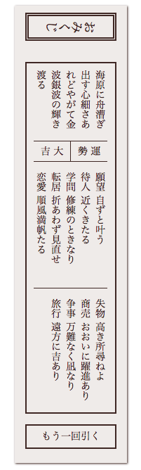

Elm O-mikuji ([Try It](https://y-taka-23.github.io/elm-omikuji/))
=================================================================

A sample of o-mikuji (Shinto fortunes) written in Elm.



Run Things Locally
------------------

```console
$ git clone https://github.com/y-taka-23/elm-omikuji.git
$ cd elm-omikuji
$ npm install
$ elm-package install
$ npm run start
```
